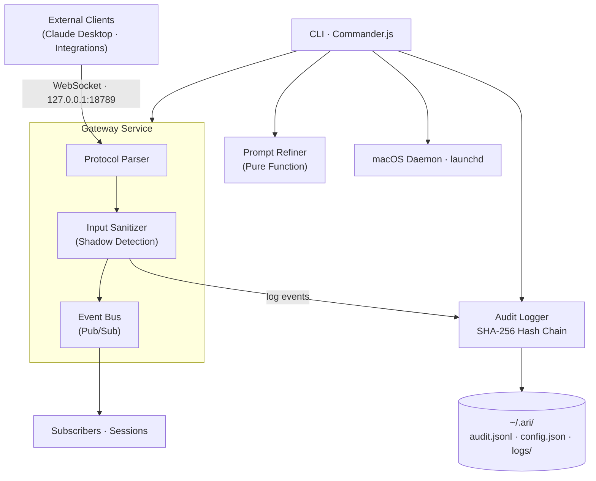

# ARI — production TypeScript multi-agent gateway (Kagemusha Protocol)

[](https://github.com/PryceHedrick/ari-vnext/actions/workflows/ci.yml)
[](https://www.typescriptlang.org/)
[](https://nodejs.org/)
[](LICENSE)

> *The shadow warrior observes, integrates, and records — never suppresses.*

---

## What is ARI?

ARI is a local-first, security-focused gateway for multi-agent AI interactions. It runs entirely on your machine — no cloud dependencies, no remote access, no data leaving your control.

At its core, ARI is a **WebSocket gateway** that sits between AI clients (Claude Desktop, custom integrations) and a structured pipeline of sanitization, auditing, and event routing. Every operation is logged in a tamper-evident SHA-256 hash chain. Suspicious patterns are observed and recorded, never silently blocked.

Built on three philosophical pillars:

| Pillar | Source | Architectural Expression |
|--------|--------|--------------------------|
| **Shadow Integration** | Carl Jung | Log suspicious patterns rather than blocking — understanding the shadow makes the system resilient |
| **Ruthless Simplicity** | Miyamoto Musashi | Every component serves one clear purpose — complexity is the enemy |
| **Radical Transparency** | Ray Dalio | All operations recorded in a tamper-evident audit trail — behavior is observable and verifiable |

---

## Version Lineage

ARI has evolved through three major protocol versions:

| Version | Protocol | Meaning | Era | Internal Origin |
|---------|----------|---------|-----|-----------------|
| v1.0.0 | **Sentinel Protocol** | The watchful guardian — first security hardening of the multi-agent architecture | Legacy | V11.1.0 |
| v2.0.0 | **Aurora Protocol** | Dawn of the Universal Life OS — expanded to a full personal operating system | Legacy | V12.0.0 |
| v3.0.0 | **Kagemusha Protocol** | 影武者 (Shadow Warrior) — complete rebuild as production TypeScript gateway | **Current** | V1.0.0 |

The Kagemusha Protocol is a ground-up rewrite. It preserves the philosophical DNA of Sentinel and Aurora but discards their implementation entirely in favor of a minimal, auditable TypeScript codebase.

---

## Architecture



---

## Quick Start

### Install and Build

```bash
git clone https://github.com/PryceHedrick/ari-vnext.git
cd ari-vnext
npm install
npm run build
```

### Initialize Configuration

```bash
ari onboard init
```

Creates the `~/.ari/` directory with default configuration, audit log, and log directories.

### Run Tests

```bash
npm test
```

### Start the Gateway

```bash
# Foreground (requires build)
ari gateway start

# As macOS daemon (auto-start on boot)
ari onboard install-daemon
```

### CLI Commands

```bash
# Gateway management
ari gateway start          # Start the gateway service
ari gateway status         # Check gateway status

# Audit operations
ari audit list            # List audit entries
ari audit verify          # Verify hash chain integrity
ari audit tail            # Watch audit log in real-time

# System setup
ari onboard init          # Initialize configuration
ari onboard install-daemon # Install as macOS launchd daemon

# Maintenance
ari doctor                # Run system diagnostics
ari refine <text>         # Test prompt refiner (pure function)
```

---

## Core Principles

### CONTENT ≠ COMMAND
All inbound content is treated as data, never as instructions. This fundamental separation prevents prompt injection attacks and maintains clear boundaries between user content and system operations.

### Shadow Integration (Jung)
Rather than blocking suspicious patterns, we log and integrate them into the audit trail. Understanding the shadow makes the system more resilient.

### Ruthless Simplicity (Musashi)
Every component serves a clear purpose. Complexity is the enemy. No feature exists without justification.

### Radical Transparency (Dalio)
All operations are logged in a tamper-evident audit trail. The system's behavior is observable and verifiable.

---

## Security Model

- **Loopback Only**: Gateway binds exclusively to `127.0.0.1` — hardcoded, not configurable
- **No Remote Access**: Cannot be accessed from the network
- **Input Sanitization**: All inputs validated through a 5-stage pipeline
- **Shadow Detection**: Suspicious patterns logged to audit trail, never blocked
- **Audit Trail**: Tamper-evident SHA-256 hash chain of all operations
- **Rate Limiting**: Token-bucket rate limiting per sender

---

## Data Storage

ARI stores all local data in `~/.ari/`:

```
~/.ari/
├── config.json       # User configuration
├── audit.jsonl       # Append-only hash-chained audit log
├── ari.pid           # Process ID (daemon mode)
└── logs/
    ├── ari-stdout.log  # Daemon stdout
    └── ari-stderr.log  # Daemon stderr
```

All data stays on your machine. No cloud syncs, no telemetry, no external calls.

---

## Project Structure

```
ari-vnext/
├── src/
│   ├── types/            # Zod schemas & TypeScript types
│   ├── config/           # Configuration management
│   ├── utils/            # Pino structured logging
│   ├── security/         # Input sanitization with shadow detection
│   ├── audit/            # SHA-256 hash-chained audit logger
│   ├── gateway/          # WebSocket server, event bus, protocol
│   ├── prompting/        # Pure-function prompt refiner
│   ├── ops/              # macOS launchd daemon management
│   ├── cli/              # Commander.js CLI
│   └── index.ts          # Public API exports
├── docs/                 # Architecture, security, API, principles
├── CONTEXTS/             # Namespace isolation (ventures, life)
└── .github/              # CI/CD workflows, issue templates
```

## Technology Stack

- **Runtime**: Node.js 22+ with TypeScript 5.4+ (strict mode, all flags)
- **Gateway**: WebSocket server ([ws](https://github.com/websockets/ws))
- **Storage**: JSONL append-only files
- **Crypto**: SHA-256 hash chains (Node.js native `crypto`)
- **Process**: macOS launchd daemon
- **Validation**: [Zod](https://zod.dev) schemas
- **Logging**: [Pino](https://getpino.io) structured logging
- **Testing**: [Vitest](https://vitest.dev) — 56 tests passing
- **CLI**: [Commander.js](https://github.com/tj/commander.js)

---

## Documentation

| Document | Description |
|----------|-------------|
| [Architecture](docs/ARCHITECTURE.md) | System design, components, data flow, and version evolution |
| [Security](docs/SECURITY.md) | Security model, threat analysis, and shadow detection |
| [Operations](docs/OPERATIONS.md) | Installation, daemon management, and troubleshooting |
| [Principles](docs/PRINCIPLES.md) | Engineering philosophy (Jung, Musashi, Dalio) |
| [API](docs/API.md) | WebSocket protocol reference and audit log format |
| [Governance](docs/GOVERNANCE.md) | Multi-agent council framework and context namespaces |

---

## Development Status

**Current: v3.0.0 — Kagemusha Protocol**
- Core gateway with WebSocket server (127.0.0.1:18789)
- 5-stage input sanitization with shadow pattern detection
- SHA-256 hash-chained audit logging (tamper-evident)
- Typed pub/sub event bus with wildcard support
- Commander.js CLI (gateway, audit, onboard, doctor, refine)
- macOS launchd daemon support
- Pure-function prompt refiner
- 56 tests passing, TypeScript strict mode (all flags)

---

## Contributing

See [CONTRIBUTING.md](CONTRIBUTING.md) for development workflow and guidelines.

## Security

For security vulnerabilities, see [SECURITY.md](SECURITY.md) for reporting procedures.

## License

MIT License — Copyright (c) 2026 Pryce Hedrick
