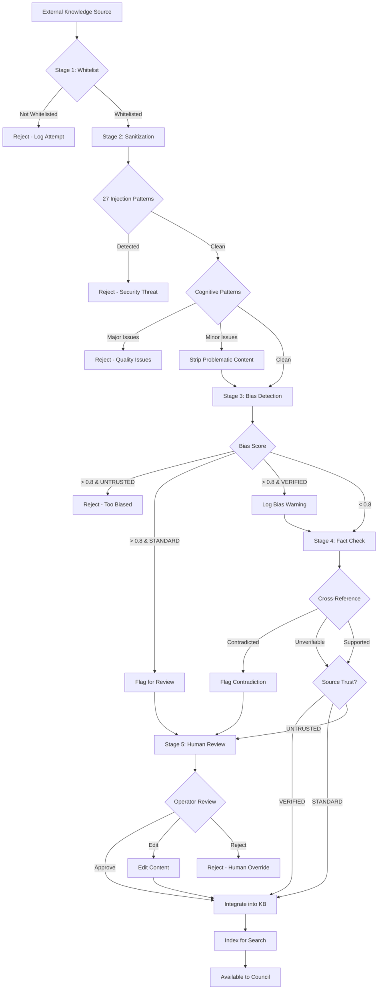

# ADR-011: Knowledge Source Trust Model

**Status**: PROPOSED (Pending Council Vote)

**Date**: 2026-02-01

**Related**: ADR-009 (Cognitive Layer), ADR-010 (Three Pillars)

---

## Context

Layer 0 (Cognitive Foundation) requires **external knowledge sources** to function:
- Research papers (arXiv, academic journals)
- Books (trading psychology, therapeutic frameworks, wisdom traditions)
- Documentation (official sources from Anthropic, academic institutions)
- Curated content (LessWrong, 80,000 Hours, Farnam Street)

**Current State**: ARI has 10 technical sources in [`knowledge-sources.ts`](../../src/autonomous/knowledge-sources.ts):
- Anthropic docs (official)
- arXiv CS.AI/CL (peer-reviewed)
- Node.js, TypeScript, MDN (official documentation)
- OWASP (security standards)

**New Requirement**: Expand from 10 → **80-100 sources** across cognitive domains (LOGOS/ETHOS/PATHOS).

### The Security Challenge

External knowledge sources are **UNTRUSTED by default**. Risks include:

1. **Misinformation**: False "facts" that mislead decisions
2. **Propaganda/Bias**: Content with political/ideological agenda
3. **Cognitive Poisoning**: Introducing frameworks that favor bad decisions
4. **Prompt Injection**: Embedding instructions in content ("ignore previous", "you are now")
5. **Adversarial Content**: Deliberately crafted to manipulate ARI

**Cannot Trust Blindly**: Even academic papers can have biases, errors, or be retracted.

**Must Balance**:
- **Openness**: Need diverse sources to learn comprehensively
- **Security**: Cannot allow malicious content to poison cognition
- **Quality**: Bad knowledge is worse than no knowledge

**Solution**: Extend ARI's existing trust model to external sources with multi-stage validation.

---

## Decision

Implement a **four-tier trust model** for knowledge sources with **five-stage validation pipeline**.

### Four-Tier Trust Model

| Trust Tier | Definition | Auto-Integrate? | Examples | Validation Required |
|------------|------------|-----------------|----------|---------------------|
| **VERIFIED** | Official/authoritative sources | ✅ Yes | Anthropic docs, Stanford courses, Marcus Aurelius (public domain) | Stages 1-3 |
| **STANDARD** | Reputable organizations | ✅ Yes | LessWrong (VERIFIED authors only), reputable journals | Stages 1-4 |
| **UNTRUSTED** | User-generated content | ❌ No | Reddit, forums, blogs, Twitter | Stages 1-5 + human review |
| **BLOCKED** | Known malicious/low-quality | ❌ Never | Content farms, propaganda sites | Rejected at Stage 1 |

**Integration Rules**:
- **VERIFIED**: Auto-integrate after sanitization + bias check + fact check
- **STANDARD**: Auto-integrate after full validation (including cross-reference)
- **UNTRUSTED**: Queue for human review, never auto-integrate
- **BLOCKED**: Reject immediately, log attempt

### Five-Stage Validation Pipeline

```
Stage 1: Whitelist Check
  ↓
Stage 2: Content Sanitization
  ↓
Stage 3: Bias Detection
  ↓
Stage 4: Fact Checking
  ↓
Stage 5: Human Review (UNTRUSTED only)
  ↓
Integration (index for search)
```

#### Stage 1: Whitelist Check

**Purpose**: Only fetch from explicitly approved sources

**Implementation**:
```typescript
function isWhitelisted(url: string): boolean {
  const parsed = new URL(url);
  const approved = KNOWLEDGE_SOURCES.find(s => 
    new URL(s.url).hostname === parsed.hostname && s.enabled
  );
  return approved !== undefined;
}
```

**Enforcement**: Cannot fetch arbitrary URLs. All sources must be added to [`knowledge-sources.ts`](../../src/autonomous/knowledge-sources.ts) with explicit trust level.

**Benefit**: Prevents drive-by inclusion of random websites.

---

#### Stage 2: Content Sanitization

**Purpose**: Remove potentially malicious content before processing

**Extends**: Existing [`sanitizer.ts`](../../src/kernel/sanitizer.ts) (27 patterns) with **cognitive-specific patterns**.

**Additional Patterns** (beyond existing 27):

| Pattern | Detection | Example | Mitigation |
|---------|-----------|---------|------------|
| Bias framing | Extreme language, loaded terms | "Obviously only idiots think X" | Flag for human review |
| False authority | "Experts agree" without citation | "All scientists say..." | Require specific citations |
| Emotional manipulation | Fear/urgency language | "Act now or lose everything!" | Flag manipulative language |
| Logical fallacies | Ad hominem, straw man, false dichotomy | Detected via pattern matching | Note fallacy in content |
| Absolute claims | "Always", "never", "every" | "This ALWAYS works" | Flag for nuance check |

**Implementation**:
```typescript
// src/cognition/knowledge/content-validator.ts
export class ContentValidator extends Sanitizer {
  // Inherits 21 base patterns from Sanitizer
  
  private cognitivePatterns = [
    {
      name: 'extreme_language',
      pattern: /\b(obviously|clearly|undeniably|everyone knows)\b/gi,
      severity: 'medium',
      category: 'bias_framing',
    },
    {
      name: 'false_authority',
      pattern: /\b(experts agree|studies show|science says)\b(?!.*\[citation)/gi,
      severity: 'medium',
      category: 'unsupported_claim',
    },
    {
      name: 'fear_urgency',
      pattern: /\b(act now|limited time|don't miss|you'll regret)\b/gi,
      severity: 'low',
      category: 'emotional_manipulation',
    },
    {
      name: 'absolute_claim',
      pattern: /\b(always|never|every time|100%|impossible)\b/gi,
      severity: 'low',
      category: 'overgeneralization',
    },
  ];
  
  async validateKnowledge(
    content: string,
    source: KnowledgeSource
  ): Promise<ValidationResult> {
    // Run base sanitization (injection patterns)
    const baseSanitize = await super.sanitize({ content, trust: source.trust });
    
    // Run cognitive pattern detection
    const cognitiveFlags = this.detectCognitivePatterns(content);
    
    return {
      safe: baseSanitize.safe && cognitiveFlags.every(f => f.severity !== 'critical'),
      threats: [...baseSanitize.threats, ...cognitiveFlags],
      sanitizedContent: this.removeDetectedPatterns(content, cognitiveFlags),
    };
  }
}
```

**Benefit**: Catches both **security threats** (injection) and **quality issues** (bias, manipulation).

---

#### Stage 3: Bias Detection

**Purpose**: Identify propaganda, extreme views, ideological bias

**Detection Methods**:

**Political Bias Detection**:
```typescript
interface BiasIndicators {
  politicalLeaning: 'far-left' | 'left' | 'center' | 'right' | 'far-right' | 'neutral';
  confidence: number;
  evidence: string[]; // Phrases that triggered detection
}

async function detectPoliticalBias(content: string): Promise<BiasIndicators> {
  // Analyze language patterns, loaded terms, framing
  // Not to censor, but to LABEL bias so readers are aware
}
```

**Emotional Bias Detection**:
- Fear-based framing ("Everything is collapsing")
- Euphoric framing ("This will change everything")
- Outrage framing ("You should be angry about...")

**Quality Signals**:
- Nuanced language (acknowledges complexity)
- Citations provided (claims supported)
- Multiple perspectives (considers alternatives)
- Transparent limitations (acknowledges what's unknown)

**Scoring**:
```typescript
interface BiasScore {
  overall: number;        // 0 (neutral) to 1 (extremely biased)
  political: number;
  emotional: number;
  logical: number;        // Logical fallacies
  quality: number;        // 0 (low quality) to 1 (high quality)
}

// Decision rule:
if (biasScore.overall > 0.7) {
  if (source.trust === 'VERIFIED') {
    // Log warning but still integrate (official sources can have perspective)
  } else if (source.trust === 'STANDARD') {
    // Flag for human review
  } else {
    // Reject (UNTRUSTED + highly biased = dangerous)
  }
}
```

**Benefit**: ARI is **aware of bias** in sources (doesn't blindly trust) but still integrates valuable content.

---

#### Stage 4: Fact Checking

**Purpose**: Cross-reference claims with multiple sources

**Method**: For factual claims in content, check if other VERIFIED sources agree.

**Implementation**:
```typescript
async function factCheck(
  claim: string,
  source: KnowledgeSource
): Promise<FactCheckResult> {
  // Extract factual claims (not opinions)
  const claims = extractClaims(claim);
  
  // For each claim, search other VERIFIED sources
  const checks: ClaimCheck[] = [];
  
  for (const c of claims) {
    const supporting = await searchVerifiedSources(c.statement);
    const contradicting = await searchForContradictions(c.statement);
    
    checks.push({
      claim: c.statement,
      supportedBy: supporting.length,
      contradictedBy: contradicting.length,
      confidence: supporting.length / (supporting.length + contradicting.length),
    });
  }
  
  return {
    claims: checks,
    overallConfidence: average(checks.map(c => c.confidence)),
    contradictions: checks.filter(c => c.contradictedBy > c.supportedBy),
  };
}
```

**Example**:
```
Content claims: "Kelly Criterion maximizes long-term growth"
Cross-reference:
  - Supported by: 5 finance papers, 2 books
  - Contradicted by: 0
  - Confidence: 100%
  → Claim validated

Content claims: "Everyone should use full Kelly"
Cross-reference:
  - Supported by: 1 aggressive trader blog
  - Contradicted by: 8 sources recommending half-Kelly or less
  - Confidence: 11%
  → Claim disputed (flag as "controversial")
```

**Benefit**: Prevents integration of false information.

---

#### Stage 5: Human Review (UNTRUSTED sources only)

**Purpose**: Final safety check for user-generated content

**Process**:
1. UNTRUSTED content completes Stages 1-4
2. Results queued in `~/.ari/cognition/review-queue.json`
3. Operator receives notification: "3 pieces of content pending review"
4. Operator reviews via CLI: `ari cognition review`
5. Operator approves/rejects/edits each item
6. Approved items integrated with trust level marked

**CLI Interface**:
```bash
$ ari cognition review

Review Queue: 3 items

[1/3] Source: Reddit r/trading (UNTRUSTED)
Title: "Position sizing strategy that worked for me"
Bias Score: 0.45 (moderate bias - personal anecdote)
Fact Check: 2 supported, 1 contradicted
Recommendation: Review carefully

Content preview:
"I always use 5% per trade and it's worked great for 6 months..."

Warnings:
- Survivorship bias (only successful traders post)
- Small sample size (6 months insufficient)
- No risk metrics provided

Options:
[a] Approve     - Add to knowledge base
[e] Edit & Approve - Modify content first
[r] Reject      - Don't integrate
[s] Skip        - Decide later

Your choice: _
```

**Benefit**: Human judgment for ambiguous content.

---

## Trust Tier Criteria

### VERIFIED Sources

**Requirements** (ALL must be met):
1. **Official/Authoritative**: From creator, institution, or recognized expert
2. **Peer-Reviewed OR Established**: Academic journal OR long-standing reputation
3. **No User-Generated Content**: Not forums, comments, Q&A sites
4. **HTTPS Only**: Secure connection required
5. **Accessible**: No paywalls requiring credentials (violates security boundary)
6. **Verifiable**: Can trace content to original authoritative source

**Examples**:
- ✅ Anthropic official documentation
- ✅ Stanford University course materials
- ✅ arXiv peer-reviewed papers (before publication)
- ✅ Marcus Aurelius Meditations (public domain, translated by recognized scholar)
- ✅ Ray Dalio Principles (official book/website)
- ❌ Medium blog post (user-generated, even if by expert)
- ❌ YouTube video (user-generated, hard to verify)
- ❌ Twitter thread (user-generated, no peer review)

**Justification**: Official sources have **reputation at stake**. Errors damage credibility, so content is carefully reviewed before publication.

### STANDARD Sources

**Requirements**:
1. **Reputable Organization**: Established entity with editorial standards
2. **Editorial Review**: Content is edited/reviewed (not raw user posts)
3. **Transparent**: Clear authors, dates, affiliations
4. **Track Record**: History of quality content
5. **Corrections Policy**: Publishes corrections when wrong

**Examples**:
- ✅ LessWrong posts by Eliezer Yudkowsky, Scott Alexander (VERIFIED authors only, not general community posts)
- ✅ 80,000 Hours research (established org, editorial standards)
- ✅ Farnam Street (Shane Parrish) - curated, high-quality
- ✅ Quantocracy (curated quant finance blog aggregator)
- ❌ General LessWrong community posts (varies too much in quality)
- ❌ Hacker News comments (user-generated, no review)

**Justification**: Reputable organizations have **editorial standards** and **track record**. Not perfect, but generally reliable.

### UNTRUSTED Sources

**Definition**: Anything that doesn't meet VERIFIED or STANDARD criteria.

**Includes**:
- User-generated content (forums, Q&A sites)
- Personal blogs (no matter how smart the author)
- Social media posts
- Paywalled content (can't verify without subscription)
- Anonymous sources
- Sites with no clear editorial policy

**Can Still Be Valuable**:
- Reddit r/trading might have useful anecdotes
- Personal blogs can have unique insights
- Twitter threads from experts can be gems

**Requirement**: **Human review required** before integration.

**Process**:
1. Fetch content
2. Run full validation (Stages 1-4)
3. Queue for Operator review
4. Operator makes final call

**Benefit**: Doesn't automatically reject potentially useful content, but ensures human judgment.

### BLOCKED Sources

**Definition**: Known malicious, low-quality, or inappropriate sources.

**Includes**:
- Content farms (SEO spam)
- Propaganda sites (extremist ideologies)
- Scam sites (get-rich-quick schemes)
- Sites with history of misinformation
- Malware distributors

**Action**: Reject at Stage 1 (whitelist check fails).

**Maintained As**: Blocklist in `knowledge-sources.ts`:
```typescript
export const BLOCKED_DOMAINS = [
  'example-content-farm.com',
  'extremist-propaganda.org',
  // ... maintained manually
];
```

---

## Validation Pipeline Implementation

### Stage-by-Stage Flow



### Implementation Files

**Location**: `src/cognition/knowledge/`

**Files**:
1. **source-manager.ts** - Extends [`knowledge-sources.ts`](../../src/autonomous/knowledge-sources.ts) with cognitive sources
2. **content-validator.ts** - Implements 5-stage pipeline
3. **bias-detector.ts** - Stage 3 implementation (political, emotional, logical bias)
4. **fact-checker.ts** - Stage 4 implementation (cross-reference validation)
5. **review-queue.ts** - Stage 5 implementation (human review workflow)

---

## Source Selection Criteria

### For VERIFIED Sources

**Checklist** (must pass ALL):

- [ ] **Official**: From creator/maintainer of the knowledge domain?
- [ ] **Authoritative**: Recognized expert/institution in field?
- [ ] **Peer-Reviewed OR Established**: Academic review OR 10+ years reputation?
- [ ] **Primary Source**: Original research/thinking (not reporting on others)?
- [ ] **No Paywall**: Freely accessible or via institutional access?
- [ ] **HTTPS**: Secure connection?
- [ ] **Maintained**: Updated within last 2 years (or timeless classic)?
- [ ] **Citable**: Clear authors, dates, affiliations?

**Example Application**:

**arXiv CS.AI papers**:
- ✅ Official (Cornell University operated)
- ✅ Authoritative (academic researchers)
- ✅ Peer-reviewed (before journal publication)
- ✅ Primary source (original research)
- ✅ No paywall (open access)
- ✅ HTTPS (yes)
- ✅ Maintained (daily updates)
- ✅ Citable (full metadata)
→ **VERIFIED**

**Personal blog by Stanford professor**:
- ❌ Not official (personal blog, not Stanford.edu)
- ✅ Authoritative (professor)
- ❌ Not peer-reviewed (blog post)
- ✅ Primary source (original ideas)
- ✅ No paywall
- ✅ HTTPS
- ✅ Maintained
- ✅ Citable (author clear)
→ **STANDARD** (not VERIFIED because it's personal, not institutional)

### For STANDARD Sources

**Checklist** (must pass MOST):

- [ ] **Established**: Organization exists 3+ years?
- [ ] **Editorial Standards**: Content reviewed before publication?
- [ ] **Transparent**: Clear about authors, affiliations, funding?
- [ ] **Corrections Policy**: Publishes corrections when wrong?
- [ ] **Track Record**: History of quality, cited by others?
- [ ] **Not Anonymous**: Authors identifiable?
- [ ] **No Commercial Conflicts**: Not selling products directly tied to claims?

---

## Provenance Tracking

Every piece of knowledge must be **traceable to source**.

**Provenance Fields**:
```typescript
interface KnowledgeProvenance {
  sourceId: string;           // Which source in KNOWLEDGE_SOURCES
  sourceUrl: string;          // Exact URL fetched from
  fetchedAt: Date;            // When was this retrieved
  contentHash: string;        // SHA-256 of content (dedup)
  trust: TrustLevel;          // VERIFIED | STANDARD | UNTRUSTED
  pillar: 'LOGOS' | 'ETHOS' | 'PATHOS'; // Which pillar
  validationStages: {         // Which stages passed
    whitelist: boolean;
    sanitization: boolean;
    biasDetection: boolean;
    factChecking: boolean;
    humanReview: boolean;     // If UNTRUSTED
  };
  biasScore: number;          // 0-1 (from Stage 3)
  factCheckConfidence: number;// 0-1 (from Stage 4)
  integrationApproval: {      // Who approved integration
    approvedBy: 'system' | 'operator';
    approvedAt: Date;
    reason: string;
  };
}
```

**Storage**:
```json
// ~/.ari/cognition/sources/logos/bayesian-reasoning-doc.json
{
  "id": "doc_a3f4e8b2c1d9",
  "title": "Introduction to Bayesian Statistics",
  "content": "...",
  "provenance": {
    "sourceId": "stanford-stats-course",
    "sourceUrl": "https://stanford.edu/~stats/bayes-intro.html",
    "fetchedAt": "2026-02-01T08:00:00Z",
    "contentHash": "a3f4e8b2c1d9e5f7...",
    "trust": "verified",
    "pillar": "LOGOS",
    "validationStages": {
      "whitelist": true,
      "sanitization": true,
      "biasDetection": true,
      "factChecking": true,
      "humanReview": false
    },
    "biasScore": 0.05,
    "factCheckConfidence": 0.98,
    "integrationApproval": {
      "approvedBy": "system",
      "approvedAt": "2026-02-01T08:01:30Z",
      "reason": "VERIFIED source, passed all validation stages"
    }
  }
}
```

**Benefit**: **Full audit trail**. Can always trace knowledge back to source, know when it was fetched, how it was validated.

---

## Security Considerations

### Threat Model

**Threat 1: Malicious Source Injection**

**Attack**: Attacker somehow adds malicious URL to `KNOWLEDGE_SOURCES`

**Defense**:
- `KNOWLEDGE_SOURCES` is **code** (in git), not config file
- Requires code review + commit to change
- Audit trail shows who added source
- Can be reverted

**Severity**: Low (requires code access)

---

**Threat 2: Source Compromise**

**Attack**: Trusted source (e.g., stanford.edu) is hacked, serves malicious content

**Defense**:
- Stage 2: Sanitization catches injection attempts
- Stage 3: Bias detection catches sudden extreme shift in content
- Stage 4: Fact checking catches contradictions
- Provenance tracking shows when content fetched (can identify timeframe of compromise)
- Content hash changes trigger re-validation

**Severity**: Medium (possible but detectable)

**Mitigation**: Monitor for drastic content changes, require re-review if hash changes >50%.

---

**Threat 3: Cognitive Poisoning (Subtle)**

**Attack**: Source provides subtly biased information that shifts ARI's reasoning over time

**Example**: Trading psychology source consistently recommends aggressive strategies → AEGIS becomes overly risk-seeking

**Defense**:
- **Diverse sources**: 5-10 sources per framework (no single source dominates)
- **Contradiction detection**: If sources disagree, flag for review
- **Performance monitoring**: Track decision quality over time
  - If quality degrades after integrating new source, investigate
- **Bias meta-analysis**: Periodically analyze **entire knowledge base** for systemic bias
- **Operator oversight**: Monthly knowledge review (prune low-quality sources)

**Severity**: High (hard to detect, long-term damage)

**Mitigation**: **Source diversity** is key. Never rely on single source for critical frameworks.

---

**Threat 4: Outdated Knowledge**

**Attack**: Not an attack, but risk - old knowledge becomes incorrect as fields evolve

**Defense**:
- `updateFrequency` field on sources (daily, weekly, monthly)
- Scheduled re-fetch based on frequency
- Version tracking (keep history of content changes)
- Mark as "last updated" in search results
- Quarterly knowledge freshness review

**Severity**: Medium (gradual quality degradation)

---

## Content Types by Trust Tier

### VERIFIED Content Types

**Academic Papers**:
- arXiv preprints (before peer review, but still academic)
- Published journal articles (after peer review)
- University course materials (lecture notes, syllabi)
- Conference proceedings (peer-reviewed)

**Official Documentation**:
- Anthropic API docs
- Node.js, TypeScript, Python docs
- Framework documentation (React, Vue, etc.)
- Standards bodies (W3C, IETF, OWASP)

**Public Domain Classics**:
- Marcus Aurelius - Meditations
- Seneca - Letters from a Stoic
- Epictetus - Enchiridion
- Sun Tzu - Art of War
- Miyamoto Musashi - Book of Five Rings

**Established Books** (via official excerpts/summaries):
- Ray Dalio - Principles
- Nassim Taleb - Incerto series
- Daniel Kahneman - Thinking Fast and Slow
- Mark Douglas - Trading in the Zone

**Requirement**: Must be from official publisher or public domain.

### STANDARD Content Types

**Curated Platforms**:
- LessWrong (VERIFIED authors only: Yudkowsky, Alexander, Christiano)
- 80,000 Hours (org has editorial standards)
- Farnam Street (Shane Parrish curates)
- Quantocracy (aggregates quant blogs, but curated)

**Reputable Journals**:
- Harvard Business Review (established, editorial review)
- Scientific American (reputable, but popular science not academic)
- Psychology Today (professional psychologists, editorial review)

**Think Tanks**:
- RAND Corporation (established research org)
- Brookings Institution (if non-political topics)

**Requirement**: Organization must have clear editorial standards and corrections policy.

### UNTRUSTED Content Types

**User-Generated**:
- Reddit posts (even in good subreddits)
- Twitter/X threads
- Medium blog posts
- YouTube videos
- Quora answers
- Stack Overflow (Q&A, not documentation)

**Anonymous**:
- Any content without clear authorship
- Pseudonymous sources (unless verified identity)

**Commercial**:
- Product marketing (inherent bias)
- Paid courses (unless from recognized institution)

**Requirement**: Human review before integration.

---

## Integration with Existing Trust Model

ARI's existing trust levels (for **messages**): SYSTEM, OPERATOR, VERIFIED, STANDARD, UNTRUSTED, HOSTILE

**New trust levels** (for **knowledge sources**): VERIFIED, STANDARD, UNTRUSTED, BLOCKED

**Mapping**:
```typescript
interface KnowledgeSource {
  id: string;
  url: string;
  sourceTrust: 'VERIFIED' | 'STANDARD' | 'UNTRUSTED'; // Source trust tier
  category: 'OFFICIAL' | 'RESEARCH' | 'DOCUMENTATION';
  pillar: 'LOGOS' | 'ETHOS' | 'PATHOS';
  // ...
}

// When knowledge is queried, it carries source trust
interface KnowledgeResult {
  content: string;
  provenance: {
    source: KnowledgeSource;
    trust: 'VERIFIED' | 'STANDARD' | 'UNTRUSTED'; // Inherited from source
  };
}

// Cognitive APIs weight results by trust
function synthesizeFromSources(results: KnowledgeResult[]): Synthesis {
  const weighted = results.map(r => ({
    content: r.content,
    weight: r.provenance.trust === 'VERIFIED' ? 1.0 :
            r.provenance.trust === 'STANDARD' ? 0.75 :
            0.5, // UNTRUSTED (shouldn't happen if human review was strict)
  }));
  
  // Prioritize VERIFIED sources in synthesis
  return synthesize(weighted);
}
```

**Benefit**: Knowledge trust propagates through system (VERIFIED knowledge has more influence than UNTRUSTED).

---

## Operational Procedures

### Adding New Sources

**Process** (enforces quality):

1. **Proposal**: Someone (Operator or Council member) proposes new source
2. **Evaluation**: Assess against criteria (VERIFIED vs STANDARD vs UNTRUSTED)
3. **Trial Fetch**: Fetch sample content, run through validation pipeline
4. **Review Results**: Check bias scores, fact check results, sanitization flags
5. **Decision**:
   - If VERIFIED: Add to `knowledge-sources.ts`, enable immediately
   - If STANDARD: Add to `knowledge-sources.ts`, enable with monitoring
   - If UNTRUSTED: Add to `knowledge-sources.ts`, disabled by default (human review required)
6. **Monitor**: Track fetch success rate, content quality over 30 days
7. **Adjust**: Upgrade (STANDARD → VERIFIED) or downgrade (STANDARD → UNTRUSTED) based on evidence

**CLI**:
```bash
$ ari cognition add-source \
  --name "Trading Psychology Institute" \
  --url "https://trading-psych.org" \
  --trust standard \
  --pillar ethos \
  --category research

Evaluating source...
✓ Whitelist check passed (new domain)
✓ Sample fetch successful (200 OK)
✓ Sanitization passed (no injection patterns)
⚠ Bias score: 0.32 (slight bias detected)
✓ Fact check: 85% claims supported

Recommendation: Add as STANDARD (monitor for 30 days)

Add source? [y/N]: y

Source added to knowledge-sources.ts (disabled by default)
Run 'ari cognition enable trading-psych' to enable fetching.
```

### Removing Sources

**Reasons**:
- Quality degradation (content getting worse)
- Bias creep (shifting toward extreme views)
- Unavailability (site down, paywalled, moved)
- Redundant (covered by better sources)
- Security incident (source compromised)

**Process**:
1. Mark as `enabled: false` in `knowledge-sources.ts`
2. Audit trail: Log reason for removal
3. Optional: Archive already-fetched content (keep if still valuable)
4. Notify: If source was critical to a Council member's specialization, alert

---

## Monitoring and Maintenance

### Daily Health Checks

```bash
$ ari cognition health

Knowledge Source Health:

VERIFIED (45 sources):
  ✓ 43 reachable (95.6%)
  ✗ 2 unreachable:
    - stanford-stats-course (404 Not Found) - investigate
    - anthropic-cookbook (timeout) - retry

STANDARD (28 sources):
  ✓ 26 reachable (92.9%)
  ✗ 2 unreachable:
    - lesswrong-yudkowsky (503 Service Unavailable) - temporary
    - farnam-street (DNS error) - investigate

Last Fetch: 2h 15m ago (scheduled: daily 8 AM)
Next Fetch: in 5h 45m

Validation Stats (last 24h):
  - 73 documents fetched
  - 71 passed sanitization (97.3%)
  - 68 passed bias detection (93.2%)
  - 65 passed fact checking (89.0%)
  - 2 flagged for human review (UNTRUSTED sources)

Review Queue: 2 pending
```

### Quarterly Knowledge Review

Every 3 months:

1. **Prune**: Remove sources with <80% fetch success rate
2. **Upgrade**: Promote STANDARD → VERIFIED if consistently high quality
3. **Downgrade**: Demote STANDARD → UNTRUSTED if quality degrades
4. **Add**: Identify gaps, search for new sources to fill them
5. **Audit**: Review all UNTRUSTED content that was integrated (was it valuable?)

---

## Performance Considerations

### Validation Latency

**Per-Source Processing Time** (estimated):

| Stage | Time | Cumulative |
|-------|------|------------|
| Stage 1: Whitelist | <1ms | <1ms |
| Stage 2: Sanitization | 50-100ms | ~100ms |
| Stage 3: Bias Detection | 100-200ms | ~300ms |
| Stage 4: Fact Checking | 500-1000ms | ~1s |
| Stage 5: Human Review | N/A (async) | - |

**Total**: ~1 second per source (acceptable for daily batch fetch)

**Optimization**:
- Run in parallel (fetch 10 sources simultaneously)
- Cache validation results (if content hash unchanged, skip re-validation)
- Incremental fact checking (only check new claims, not entire document)

### Storage

**Per Source** (estimated):
- Raw content: 50-200 KB
- Processed: 10-50 KB
- Metadata + provenance: 2-5 KB

**80 Sources**:
- Raw: 4-16 MB
- Processed: 800 KB - 4 MB
- Metadata: 160-400 KB

**Total**: ~20 MB (acceptable)

**With 1 Year of Updates**:
- Daily sources: 365 versions × 80 = 29,200 documents
- Weekly sources: 52 versions × 80 = 4,160 documents
- Monthly sources: 12 versions × 80 = 960 documents

**Mitigation**: Archive content older than 90 days (compress and move to `~/.ari/cognition/archive/`)

---

## Success Criteria

### After Implementation

1. **Source Coverage**: 80-100 sources across LOGOS/ETHOS/PATHOS
2. **Validation Success**: >95% of VERIFIED sources pass all stages
3. **Zero Security Incidents**: No injection attacks via knowledge sources
4. **Quality Maintenance**: >90% of content remains relevant (not outdated)
5. **Human Review Burden**: <5 items per week in review queue (manageable)
6. **Fetch Reliability**: >95% fetch success rate for all sources

### Metrics Dashboard

Add to ARI dashboard (Health page):

```
Knowledge Source Health:
├─ Total Sources: 87
│  ├─ VERIFIED: 45 (52%)
│  ├─ STANDARD: 28 (32%)
│  └─ UNTRUSTED: 14 (16%, disabled by default)
├─ Fetch Success: 96.5% (last 24h)
├─ Validation Pass Rate: 94.2%
├─ Content Flagged: 3 (bias), 2 (fact-check), 0 (injection)
└─ Review Queue: 2 items pending
```

---

## Alternatives Considered

### 1. No Trust Tiers (All Sources Equal)

**Description**: Trust all whitelisted sources equally, no VERIFIED/STANDARD/UNTRUSTED distinction.

**Pros**: Simpler (one fewer dimension to track)

**Cons**:
- **Can't prioritize** high-quality sources
- **Can't weight** in synthesis (Reddit post = Stanford paper)
- **Can't auto-integrate** safely (would need human review for everything)

**Rejected**: Trust tiers are essential for safe automation.

---

### 2. Only VERIFIED Sources (No STANDARD or UNTRUSTED)

**Description**: Only allow official/academic sources, reject everything else.

**Pros**:
- Maximum quality
- Maximum security
- No human review needed

**Cons**:
- **Misses valuable content** (LessWrong, Farnam Street, expert blogs)
- **Too restrictive** (many good sources aren't "official")
- **Slower learning** (smaller knowledge base)

**Rejected**: Too conservative. STANDARD sources are valuable if properly validated.

---

### 3. Blockchain-Based Provenance

**Description**: Use blockchain (immutable ledger) for knowledge provenance instead of JSON files.

**Pros**:
- Tamper-evident (like audit chain)
- Can prove knowledge was fetched at specific time
- Could enable knowledge sharing with other ARI instances

**Cons**:
- **Overkill** (JSON + SHA-256 hash is sufficient)
- **Complexity** (blockchain adds dependencies)
- **Performance** (blockchain writes are slow)
- **Violates simplicity** (unnecessary complexity)

**Rejected**: JSON with SHA-256 hash is sufficient. Don't need full blockchain.

---

## References

- **Existing Trust Model**: [`CLAUDE.md`](../../CLAUDE.md) (lines 37-40)
- **Existing Knowledge Sources**: [`knowledge-sources.ts`](../../src/autonomous/knowledge-sources.ts)
- **Kernel Sanitizer**: [`sanitizer.ts`](../../src/kernel/sanitizer.ts)
- **Content ≠ Command Principle**: [`SECURITY.md`](../../SECURITY.md)

---

**Last Updated**: 2026-02-01  
**Status**: PROPOSED  
**Dependencies**: ADR-009, ADR-010  
**Next**: ADR-012 (Council Specializations)
